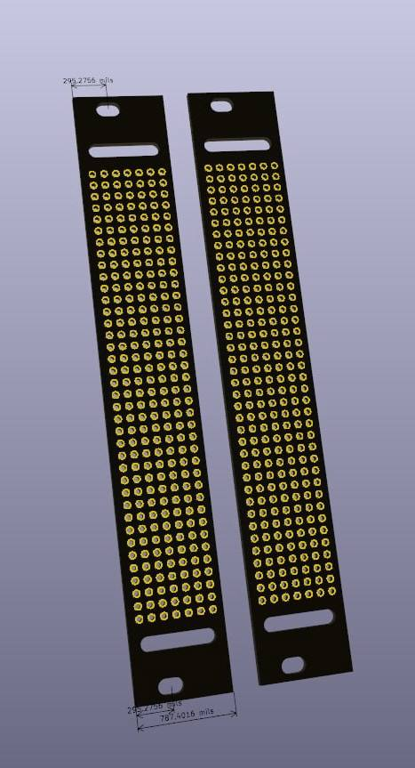

# Eurorack 4HP Stripboard for Prototyping

This repository contains files for a 4HP stripboard designed specifically for prototyping Eurorack modules. The stripboard provides a compact and versatile platform for developing, testing, and experimenting with Eurorack circuit designs, allowing quick customization of layouts in a standardized format.

## Features

- **4HP Width**: Fits the standard Eurorack 4HP format, making it ideal for slim designs.
- **Standardized Spacing**: Hole spacing follows the Eurorack 3.5mm jack and potentiometer layout for easy assembly.
- **Easy Soldering & Wiring**: Designed to make prototyping circuits straightforward, with ample room for components despite the narrow width.
- **Customizable Layouts**: Suitable for a variety of Eurorack circuit prototypes, including audio, CV, and modulation circuits.

## Repository Structure

- **/4hp/4HP_Gerbers.zip**: Gerber files for manufacturing with JLCPCB.
- **/4hp/4hp pcb.kicad_pcb**: KiCad project files for customization or further modification.

## License

This project is open-source. Please refer to the LICENSE file for more details.

---

Happy prototyping! Feel free to contribute, open issues, or submit pull requests if you have improvements or suggestions.
